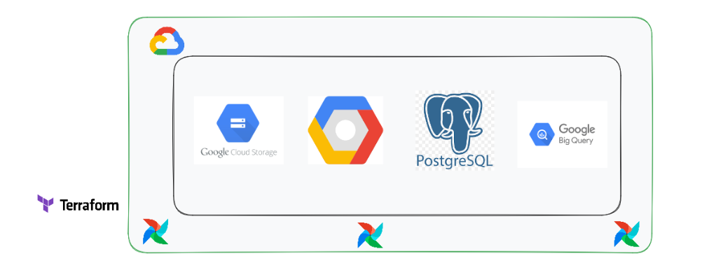
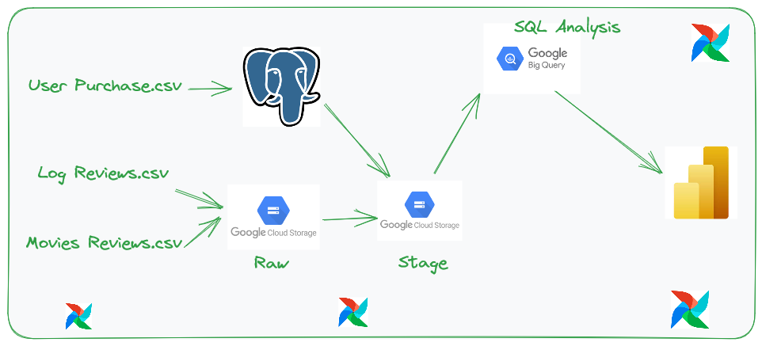
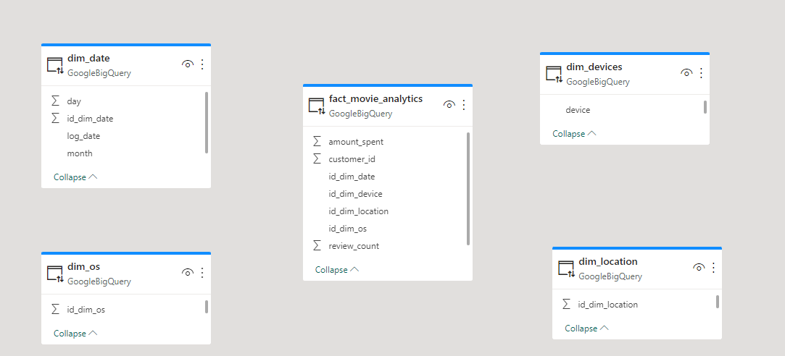

# Wizeline_Capstone_Project

### Here is the final project deliverable for [Wizeline Academy](https://academy.wizeline.com/) Data Engineering bootcamp.

For this project, I took up the role of a data engineer responsible for handling the end to end data engineering pipline from development to deployment

Techonologies used for this project include:
- **Terraform**: Infrastructure Provisioning
- **Google Cloud**: Cloud Services
- **Google Compute Engine**: Code Environment
- **Google Cloud Storage**: Data Lake Storage
- **Apache Airflow**: Pipeline Automation and Monitoring
- **PostgreSQL**: Data Storage
- **Google BigQuery**: Data Warehouse
- **Power BI**: Data Visualization

### Infrastucture

### Code Pipeline

 

For the final output in the data pipeline, a star schema data model was created
 

